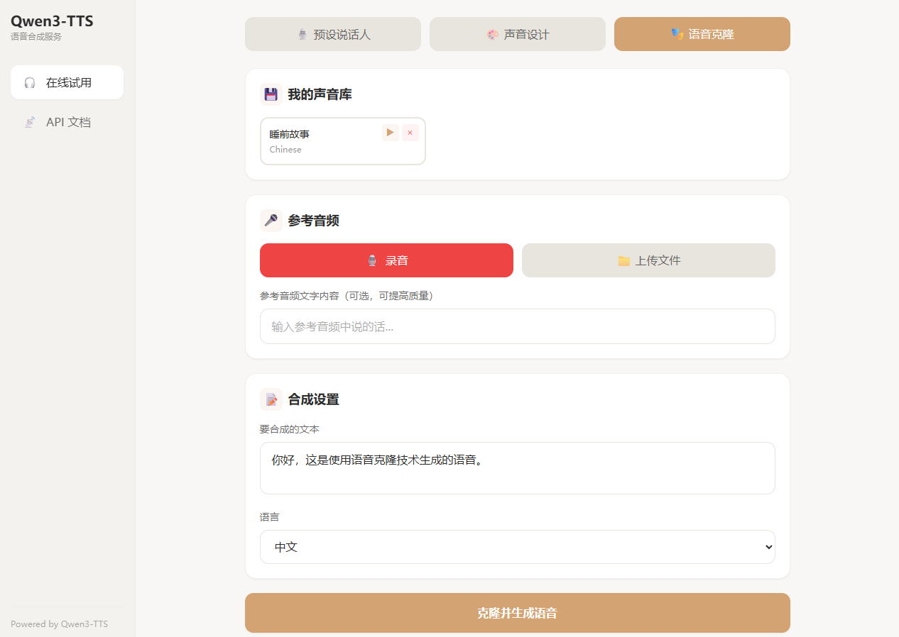

# VibeVoice

[English](README_EN.md)

AI 有声书生成平台，基于 Qwen3-TTS 模型，支持预设说话人、语音克隆、声音设计和逐句编辑。



> **注意**: 由于官方 SDK 暂未开放流式输出接口，本项目暂不支持流式语音输出。

---

## 功能特性

- **三种生成模式**: 预设说话人（9种声音+情感控制）、语音克隆、声音设计（自然语言描述）
- **声音库**: 保存和管理克隆/设计的声音，方便重复使用
- **句子编辑器**: 生成后逐句编辑、重新生成、删除、插入，支持逐句声音和情感配置
- **分句预览**: 生成前预览分句结果，可调整文本、情感、声音后再生成
- **项目管理**: 多项目多章节组织，左侧项目树导航
- **智能分析**: LLM 自动识别角色和情感，一键分配声音
- **多语言**: 支持10种语言，中英双语界面
- **REST API**: 便于集成到您的应用

## 详细功能

1. **分句进度显示** - 长文本自动分句，逐句生成并实时显示进度和耗时
2. **停止生成** - 随时取消正在进行的生成，系统会在下一句边界停止
3. **字幕生成** - 自动生成与音频时间同步的 SRT/VTT 字幕文件，适合视频制作
4. **语言自动检测** - 根据输入文本自动识别语言（中/英/日/韩），并自动设置语言选择器
5. **Voice Prompt 缓存** - 声音库条目的 voice prompt 缓存到磁盘，免去重复提取，大幅加速后续生成
6. **MP3 导出** - 支持在浏览器中直接转换并下载 MP3 格式（除 WAV 外）
7. **声音设计** - 通过自然语言描述创建自定义声音（如"低沉温暖的中年男声"），多句生成自动保持音色一致
8. **逐句声音选择** - 每句可选择不同声音（预设/声音库），支持混合声音生成
9. **逐句情感指令** - 每句可独立设置情感指令，不同于全局情感
10. **智能角色分析** - 基于 Qwen3-4B 的角色/情感自动识别，一键分配声音到对话角色

## 支持的语言

中文、英语、日语、韩语、德语、法语、俄语、葡萄牙语、西班牙语、意大利语

## 预设说话人

| 说话人 | 语言 | 性别 |
|--------|------|------|
| vivian | 中文 | 女 |
| uncle_fu | 中文 | 男 |
| aiden | 英语 | 男 |
| serena | 英语 | 女 |
| ono_anna | 日语 | 女 |
| sohee | 韩语 | 女 |
| dylan | - | 男 |
| eric | - | 男 |
| ryan | - | 男 |

---

## 安装

### 环境要求

- Python 3.8+
- 支持 CUDA 的 GPU（建议8GB以上显存），或 macOS Apple Silicon (M1/M2/M3)
- 支持 CUDA 或 MPS 的 PyTorch

> **macOS 用户注意**: Apple Silicon 芯片通过 MPS 后端支持，会自动检测并使用 float16 精度。实际兼容性取决于 qwen-tts 库对 MPS 的支持情况。

### 安装依赖

```bash
pip install -U qwen-tts fastapi uvicorn python-multipart soundfile numpy torch
```

### 下载模型

```bash
pip install -U modelscope

# CustomVoice 模型（预设说话人）
modelscope download --model Qwen/Qwen3-TTS-1.7B-CustomVoice --local_dir ./models/Qwen3-TTS-1.7B-CustomVoice

# VoiceDesign 模型（声音设计）
modelscope download --model Qwen/Qwen3-TTS-1.7B-VoiceDesign --local_dir ./models/Qwen3-TTS-1.7B-VoiceDesign

# Base 模型（语音克隆）
modelscope download --model Qwen/Qwen3-TTS-0.6B --local_dir ./models/Qwen3-TTS-0.6B
```

---

## 使用方法

### 启动服务

```bash
python api_server.py
```

服务运行在 http://localhost:8001

### 网页界面

在浏览器中打开 http://localhost:8001 即可使用网页界面。

---

## 性能优化

### Flash Attention（推荐）

安装 Flash Attention 可提升推理速度约 **50%**。

**Linux:**
```bash
pip install flash-attn --no-build-isolation
```

**Windows:**

Windows 不支持源码编译，需使用预编译包。从 [kingbri1/flash-attention](https://github.com/kingbri1/flash-attention/releases) 下载对应版本的 wheel 文件。

示例（Python 3.10 + PyTorch 2.9 + CUDA 12.8）：
```bash
# 先升级 PyTorch
pip install torch==2.9.0 torchaudio --index-url https://download.pytorch.org/whl/cu128

# 安装预编译的 flash-attn
pip install https://github.com/kingbri1/flash-attention/releases/download/v2.8.3/flash_attn-2.8.3+cu128torch2.9.0cxx11abiFALSE-cp310-cp310-win_amd64.whl
```

验证安装：启动服务后不再显示 `Warning: flash-attn is not installed`

### 进一步优化

如需达到更高性能（如官方宣称的 97ms/字），需要：

| 方案 | 预期提升 | 说明 |
|------|----------|------|
| 更强 GPU | 2-5x | A100/H100 vs 消费级显卡 |
| vLLM 部署 | 2-3x | PagedAttention + 连续批处理 |
| TensorRT-LLM | 2-5x | NVIDIA 官方推理优化 |
| FP8 量化 | 1.5-2x | 需 H100 支持 |

> 消费级显卡（RTX 40系）+ Flash Attention 达到 ~1.4s/字 是合理水平。

---

## API 文档

### 预设说话人合成

```bash
# GET 请求
curl "http://localhost:8001/tts?text=你好&speaker=vivian&language=Chinese" -o output.wav

# 带情感指令
curl "http://localhost:8001/tts?text=你好&speaker=vivian&language=Chinese&instruct=用开心的语气说" -o output.wav
```

**参数:**
| 参数 | 说明 | 默认值 |
|------|------|--------|
| text | 要合成的文本 | 必填 |
| speaker | 说话人 | vivian |
| language | 语言 | Chinese |
| instruct | 情感指令 | 可选 |

### 语音克隆

```bash
curl -X POST "http://localhost:8001/clone" \
  -F "audio=@reference.wav" \
  -F "text=你好世界" \
  -F "language=Chinese" \
  -F "ref_text=参考音频的文字内容" \
  -o output.wav
```

**参数:**
| 参数 | 说明 |
|------|------|
| audio | 参考音频文件（3-10秒） |
| text | 要合成的文本 |
| language | 语言 |
| ref_text | 参考音频文字内容（可选，提高质量） |

### 声音库管理

```bash
# 获取已保存的声音
curl http://localhost:8001/voices

# 保存声音
curl -X POST "http://localhost:8001/voices/save" \
  -F "name=我的声音" \
  -F "language=Chinese" \
  -F "audio=@reference.wav"

# 使用已保存的声音
curl -X POST "http://localhost:8001/voices/{voice_id}/tts" \
  -F "text=你好世界" \
  -o output.wav

# 删除声音
curl -X DELETE "http://localhost:8001/voices/{voice_id}"
```

### 其他接口

```bash
# 获取可用说话人
curl http://localhost:8001/speakers

# 获取支持的语言
curl http://localhost:8001/languages
```

---

## 项目结构

```
├── api_server.py          # FastAPI 服务端
├── index.html             # 网页界面（HTML 外壳）
├── static/
│   ├── style.css          # 样式
│   └── js/
│       ├── i18n.js        # 中英双语翻译
│       ├── state.js       # 全局状态 + IndexedDB 项目/章节持久化
│       ├── audio.js       # 波形播放器、WAV/MP3 编解码、音频合并
│       ├── editor.js      # 句子编辑器、分句预览、模式切换
│       ├── voice.js       # 声音库 UI、录音、设计声音
│       ├── generation.js  # 生成调度、SSE 进度、重新生成
│       ├── shortcuts.js   # 键盘快捷键
│       └── main.js        # 入口初始化
├── test_qwen_tts.py       # 测试脚本
├── models/                # 模型文件（不在仓库中）
└── saved_voices/          # 保存的克隆声音
```

---

## 更新日志

### v0.4.0 (2025-02-19)

**分句预览模式**
- 生成前可预览分句结果，编辑文本、调整情感指令、插入删除句子
- "分句预览"→ 编辑 → "生成语音"三步流程，减少无效生成

**逐句情感与声音配置**
- 每句可独立设置情感指令（预设模式），不同于全局情感
- 每句可选择不同声音（预设说话人/声音库），支持混合声音生成
- 生成计时器：生成过程中实时显示耗时（100ms 刷新）

**LLM 智能角色/情感分析**
- 集成 Qwen3-4B 模型，自动识别文本中的角色和情感
- 角色面板展示在句子编辑器顶部，支持一键分配声音到各角色
- 分析结果自动填入逐句情感指令

**项目/章节管理**
- 左侧边栏项目树导航，支持多项目多章节组织
- 项目级角色-声音映射共享，章节间复用
- IndexedDB 持久化（从单会话迁移到多项目架构），自动迁移旧数据

**声音设计独立模式**
- 声音设计恢复为独立第三 tab（预设 | 声音库 | 设计）
- 保留声音描述的自然语言表现力，不再降级为克隆 prompt

**其他改进**
- 段落边界保持：多段文本分句后保留换行结构
- 生成统计显示在右上角状态栏
- 键盘快捷键：Space 播放、方向键导航、Enter 重新生成、P 预览、Delete 删除、Ctrl+Z 撤销

### v0.3.0 (2025-02-18)

**波形可视化播放器**
- 集成 WaveSurfer.js 替代原来的简易进度条，显示音频波形
- 播放时字幕区域高亮当前句子，已播过的句子变淡

**句子编辑器**
- 生成完成后进入句子编辑视图，支持逐句操作
- 单击选中句子，双击编辑文本
- 单句重新生成（带 spinner 反馈），支持撤销（↩）回退到上一版本
- 单句删除（带确认）
- 句间添加新句子（带占位行、spinner、禁用其他按钮，完成后自动跳播）
- 句间停顿控制（0x ~ 2x 滑块，实时调整句间静音时长）
- 逐句试听（▶ 按钮，播放单句音频片段）

**会话持久化 (IndexedDB)**
- 生成结果（分句音频、文本、字幕、参数）自动保存到 IndexedDB
- 刷新页面后自动恢复上次会话，无需重新生成
- 保存句间停顿倍率等编辑状态

**声音设计跨句音色一致性**
- 多句生成时，第一句用 design 模型确立音色，后续句子自动切换为 clone 模型 + 首句 prompt，确保全部句子音色一致
- 单句重新生成和添加句子同样复用缓存的 voice prompt，不会跑偏音色
- 单句文本无额外开销，仍走纯 design 模型
- clone 模型未加载时自动 fallback 到 design 模型

**后端**
- 所有 4 个进度端点（tts/clone/design/saved_voice）返回逐句 base64 音频数组 `sentence_audios`
- 新增 `POST /regenerate` 端点，支持单句重新生成（preset/clone/design/saved_voice 四种模式）
- 克隆会话 prompt 缓存机制（`clone_session_prompts`），1 小时过期自动清理

### v0.2.0

- 分句进度显示、停止生成、字幕生成
- Voice Prompt 磁盘缓存、MP3 导出
- 声音设计模式、语言自动检测

### v0.1.0

- 预设说话人合成（9 种声音 + 情感控制）
- 语音克隆（录音/上传参考音频）
- 声音库管理
- 多语言支持（10 种语言）
- REST API、中英双语界面

---

## 许可证

VibeVoice 使用 Qwen3-TTS 模型，模型许可证请参考 [Qwen3-TTS](https://github.com/QwenLM/Qwen3-TTS)。
